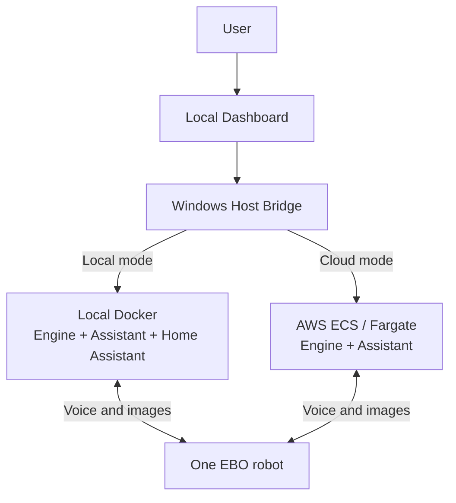
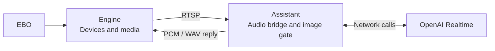
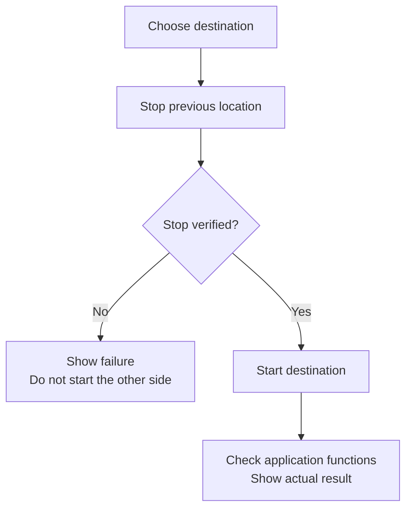
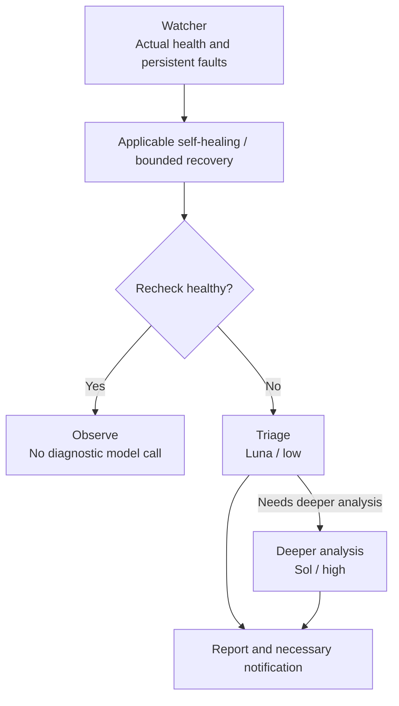
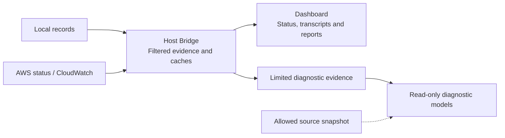

# EBO Complete Edition: Local, Cloud and Diagnostic Agent

2026-10-04 · Branch `main` · [中文](COMPLETE-VERSION-INTRO.zh-CN.md) · [Version guide](../../VERSION-GUIDE.md)

`main` is the development story's primary entry point. It presents the complete pre-Frigate edition: an EBO voice-and-image assistant, local/AWS runtime switching, and an independent Diagnostic Agent.

The separate [Frigate edition on `frigate`](https://github.com/YeChen-coder/EBOBotToDigitalPet/tree/frigate) adds Frigate/MQTT, family sessions and personal memory. It is not main; its new AWS Dashboard migration is unfinished.

## 1. Two application locations

Local operation uses Engine, Realtime Assistant and Home Assistant. Cloud operation uses Engine and Assistant in a configured AWS ECS/Fargate service. The Dashboard selects one location so both sides do not compete for the robot.

**Figure 1: Choose one application location.** Diagnostic containers, the Host Bridge and the Dashboard remain local. This does not mean the entire diagnostic platform runs in AWS. Cloud use requires your deployed services, identities and permissions.

## 2. Speech and images reach the model

Engine connects the robot's proprietary transport to a device API and RTSP media. Assistant applies local motion/image gating and an audio bridge, communicates with the Realtime model, and returns answers to EBO.

**Figure 2: Main's voice-and-image path.** This edition does not use the Frigate/MQTT family-session architecture. Local deployment still needs model network access.

## 3. The Dashboard controls runtime location

The page offers **Run locally**, **Run in cloud**, and **Stop everywhere**. Switching stops and verifies the previous side before starting the selected side. Unconfirmed shutdown or failed functional checks produce a visible error. The selected mode is persisted.

**Figure 3: Switching order.** Stop everywhere attempts to stop both application locations while retaining the diagnostic control entry point. A read-only AWS identity cannot replace runtime-control permissions; see the [Dashboard guide, Chinese](../ops/diagnostics/HEALTH-REPORT.zh-CN.md).

## 4. Checks before model analysis

Watcher checks containers and actual media health. Persistent faults wait for applicable self-healing or receive bounded recovery, followed by verification. Remaining faults move to triage or deeper model analysis. Healthy operation and successful fixed recovery use no diagnostic model calls.

**Figure 4: One diagnostic flow with local and AWS adapters.** Models suggest causes and next steps; subsequent health samples establish recovery. Actions follow permissions, budgets and cooldowns rather than endless restart loops.

## 5. Records, costs and permissions

The Dashboard displays local and CloudWatch conversations, diagnostic history and reports. With the appropriate reading identities, it can also show cached OpenAI and AWS cost data. Page refreshes primarily read local caches.

**Figure 5: Display and diagnosis have different data scopes.** Raw household conversations are excluded from diagnostic model evidence. Models cannot directly operate Docker/AWS; a restricted Host Bridge handles operational actions. The conversational assistant still sends the audio, images or text needed for replies to model services.

Application source is restored from complete public snapshot `878696f`; this update changes version routing and documentation. Real credentials, household data and runtime state are excluded from Git. Initial installation uses observation mode; configure and enable processing through the [operating guide, Chinese](../ops/diagnostics/README.zh-CN.md).

Further reading: [project overview](../README.md), [local setup, Chinese](../README.zh-CN.md), [AWS integration, Chinese](../ops/diagnostics/AWS.zh-CN.md), [version guide](../../VERSION-GUIDE.md), and the [Frigate illustrated-document index](https://github.com/YeChen-coder/EBOBotToDigitalPet/blob/frigate/PROJECT_FILES%28%E6%8A%80%E6%9C%AF%E5%90%91%E6%96%87%E4%BB%B6%E7%9B%AE%E5%BD%95%29.md).
