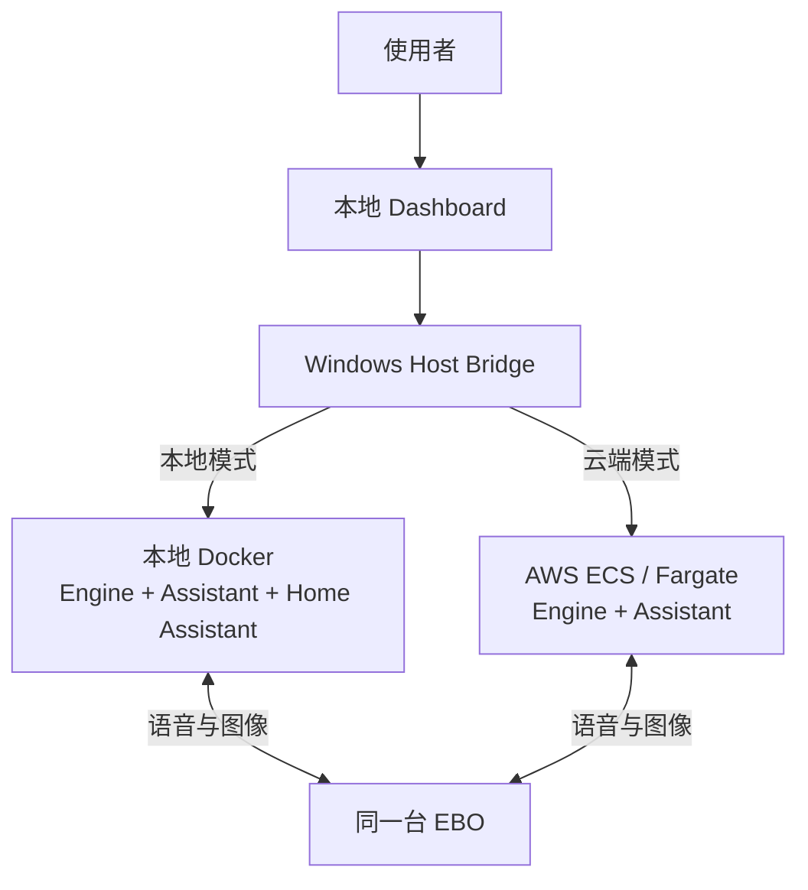
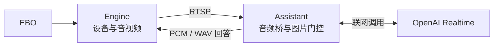
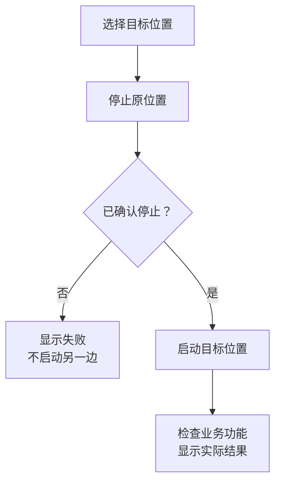
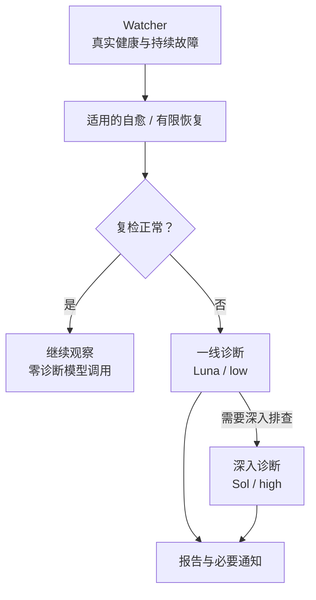
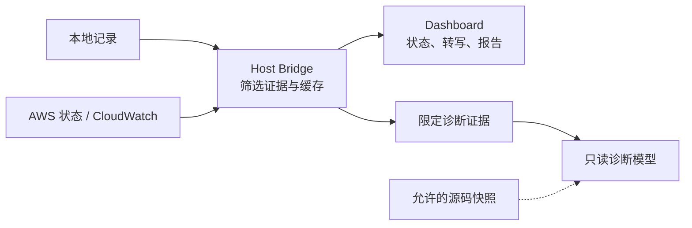

# EBO 完整版本：本地、云端与 Diagnostic Agent

2026-10-04 · 分支 `main` · [English](COMPLETE-VERSION-INTRO.en.md) · [版本导航](../../VERSION-GUIDE.md)

`main` 是项目故事的主入口，保留 Frigate 改造前已经成型的完整版本：EBO 语音与图像助手、本地／AWS 运行切换，以及独立的 Diagnostic Agent。

另有 [Frigate 版 `frigate` 分支](https://github.com/YeChen-coder/EBOBotToDigitalPet/tree/frigate)，包含 Frigate/MQTT、新家庭会话和个人记忆。它不是 main，其新版 AWS Dashboard 尚未完成迁移。

## 1. 一个项目，两种业务运行位置

本地业务包括 Engine、Realtime Assistant 和 Home Assistant；云端业务使用已有 AWS ECS/Fargate 服务中的 Engine 与 Assistant。Dashboard 选择运行位置，避免两边同时争抢同一个机器人。

**图 1：两种位置互斥选择。** 诊断容器、Host Bridge 和 Dashboard 仍在本机，不意味着整套诊断平台都部署到了 AWS。使用云端需要自己的服务、身份和权限配置。

## 2. 语音和图像如何进入模型

Engine 接入机器人的专有通道，提供设备 API 和 RTSP 音视频。Assistant 使用本地运动／图片门控和音频桥连接 Realtime 模型，再把回答送回 EBO。

**图 2：main 的语音与图片链路。** 此版本不使用 Frigate/MQTT 家庭会话架构。本地部署也需要联网调用模型。

## 3. Dashboard 管理运行位置

页面提供“本地运行”“云端运行”“全部停止”。切换先停止原位置并核实，再启动目标位置；停止未确认或功能检查失败时显示错误，不假装切换成功。选择会持久保存。

**图 3：切换顺序。** “全部停止”会尝试停止两边业务，同时保留诊断控制入口。云端只读身份不能代替启停身份，具体配置见 [Dashboard 说明](../ops/diagnostics/HEALTH-REPORT.zh-CN.md)。

## 4. Diagnostic Agent 先检查，再分析

Watcher 检查容器与实际音视频健康。持续故障先等待适用的自愈或执行有限恢复，再复检；仍有问题才进行一线或深入模型诊断。正常运行和固定恢复成功时不调用诊断模型。

**图 4：同一诊断流程适配本地和 AWS。** 模型给出原因与建议，恢复仍由后续健康采样确认。恢复遵守权限、预算和冷却；不会无限循环重启。

## 5. 记录、费用与权限

Dashboard 可以查看本地与 CloudWatch 对话记录、诊断历史和报告。配置相应读取身份后，还可查看缓存的 OpenAI 与 AWS 费用信息。页面刷新主要读取本机缓存。

**图 5：展示与诊断使用不同数据范围。** 原始家庭对话不进入诊断模型证据；诊断模型不能直接操作 Docker/AWS。实际操作由受限 Host Bridge 执行。业务助手仍会把回答所需的音频、图像或文本发给模型服务。

本分支业务源码来自完整公开快照 `878696f`，此次只恢复该源码并调整文档入口。真实密钥、家庭数据和运行状态不随 Git 发布。安装默认观察模式，按 [操作说明](../ops/diagnostics/README.zh-CN.md) 配置后启用。

继续阅读：[英文项目说明](../README.md)、[中文本地部署](../README.zh-CN.md)、[AWS 接入](../ops/diagnostics/AWS.zh-CN.md)、[版本导航](../../VERSION-GUIDE.md)、[Frigate 中英文图解目录](https://github.com/YeChen-coder/EBOBotToDigitalPet/blob/frigate/PROJECT_FILES%28%E6%8A%80%E6%9C%AF%E5%90%91%E6%96%87%E4%BB%B6%E7%9B%AE%E5%BD%95%29.md)。
