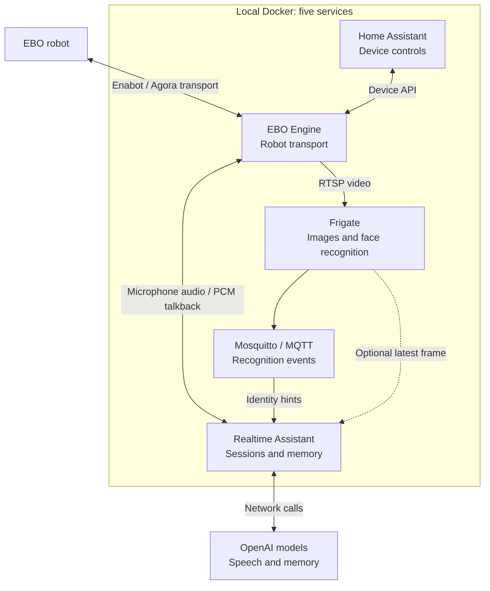
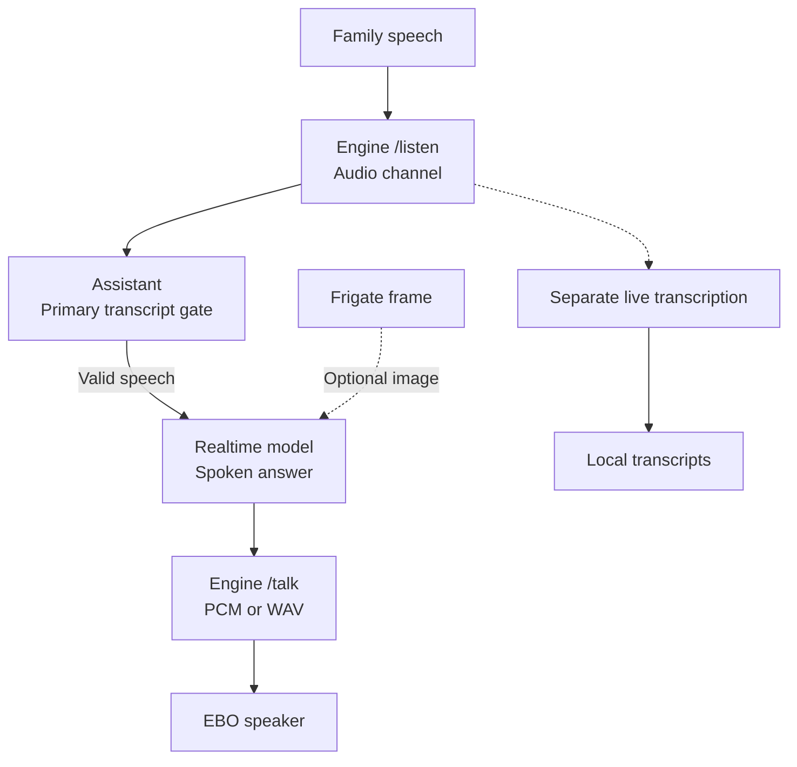
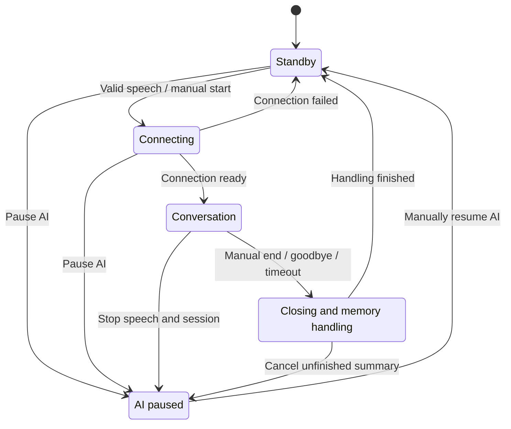
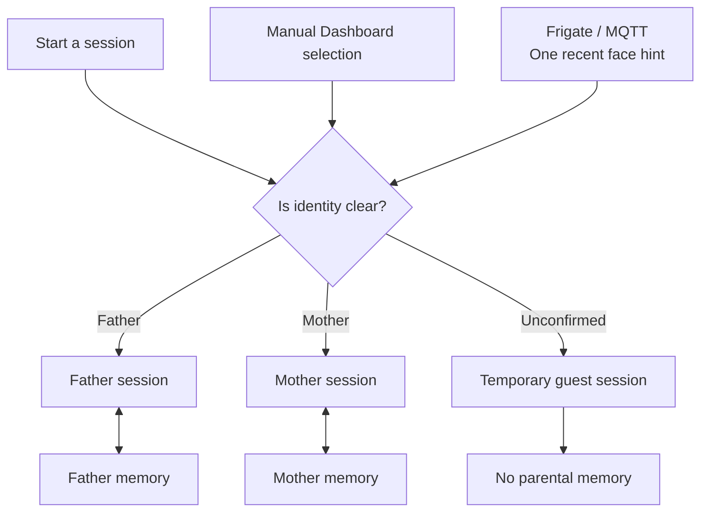
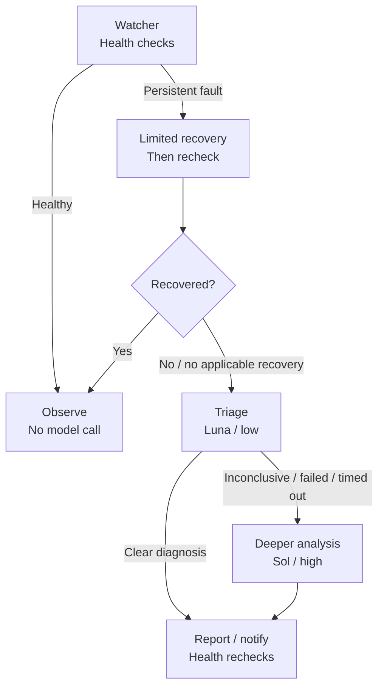
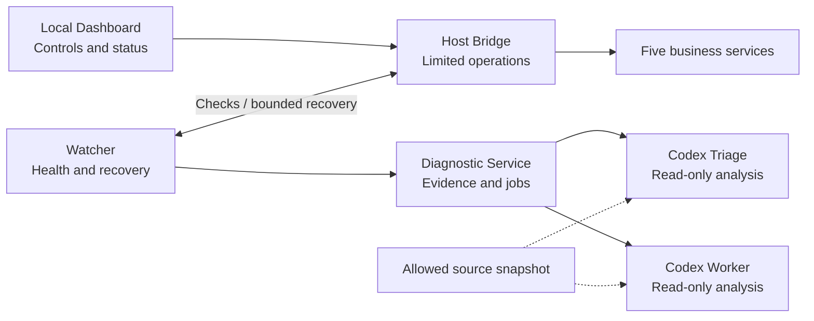
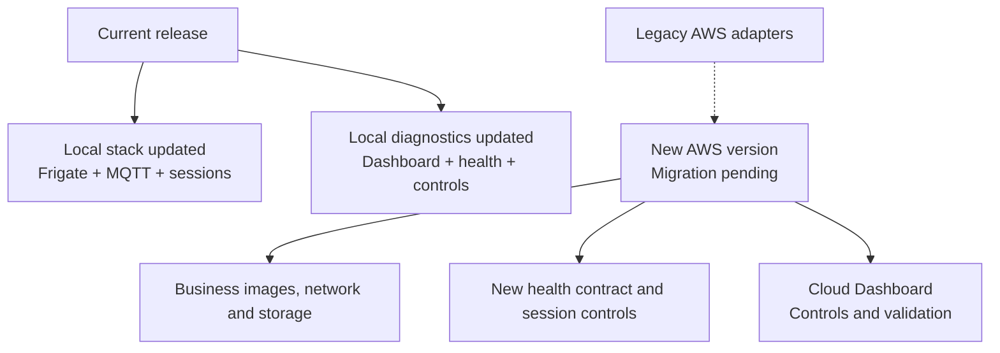

# EBO Home Assistant: Current Technical Overview

2026-10-03 · Frigate / `specter-ebo-v2` · [中文](TECHNICAL-INTRO.zh-CN.md)

This version lets EBO talk with family members, use camera images for context, and keep separate memories for each parent. An independent Diagnostic Agent checks services, attempts limited recovery, and explains faults.

**This release covers the local implementation. The AWS side of the new Diagnostic Dashboard has not been migrated or validated.** The complete previous version is preserved on [`archive/pre-frigate-2026-10-03`](https://github.com/YeChen-coder/EBOBotToDigitalPet/tree/archive/pre-frigate-2026-10-03).

## 1. What runs where

Five business services run in local Docker: Engine connects to the robot; Frigate handles images and faces; Mosquitto carries recognition events; Assistant manages AI conversations; Home Assistant provides device controls.

**Figure 1: Overall architecture.** Local deployment means the business services run on your computer. Models still require network calls; this is not a fully offline assistant.

## 2. From speech to an answer

In standby, local detection collects a complete utterance and transcription checks whether it is valid speech. During a conversation, the primary final transcript gates replies. A separate live transcription channel records speech. The assistant can also use a web research tool for public information when needed.

**Figure 2: The speech path and two supporting branches.** Healthy audio can keep conversations working when images fail. By default, people and AI take turns: microphone input is excluded during playback and a short guard afterward. Local interruption remains experimental.

## 3. Conversations start and finish

Only one session runs at a time. Valid speech or a manual Dashboard action starts it; seeing a face does not trigger an automatic greeting by default. On normal completion, sessions for known users attempt to save a summary before returning to standby.

**Figure 3: The user-facing session flow.** No Realtime connection during standby is normal. AI pause persists across restarts and leaves the camera, microphone transport, and family calls running. Resume waits for a new trigger and does not replay old audio.

## 4. Keeping family memories separate

The Dashboard can explicitly select Father or Mother. Voice wake uses a face hint only when one recent, reliable person is identified. Multiple people, stale events, or missing video produce a temporary guest session.

**Figure 4: Identity and memory separation.** Normally completed parent sessions can generate summaries, which background work later consolidates into long-term memory. Guests may still leave ordinary conversation records; no personal memory does not mean no logs. Face recognition is an identity hint, not strong authentication.

## 5. How the Diagnostic Agent handles faults

Diagnosis begins with actual health checks. Persistent faults receive an applicable, limited recovery attempt followed by verification. Successful fixed recovery uses no diagnostic model calls; unresolved faults move to model analysis.

**Figure 5: Checks and recovery before model analysis.** Model conclusions do not prove recovery. The model names abbreviate the configurable examples `gpt-5.6-luna` and `gpt-5.6-sol`. Initial setup defaults to observation mode; enable recovery and model diagnosis according to the operating guide. Intentional pause, normal standby, and disabled services are handled separately from ordinary crashes.

## 6. Control and model responsibilities

The local Dashboard starts or stops the project, pauses AI, selects sessions, and displays records and faults. Diagnostics use four separate containers, with a Windows Host Bridge providing limited operations.

**Figure 6: Analysis and operational permissions are separated.** Models read filtered evidence and allowed source snapshots. They have no Docker/AWS operating permissions and do not automatically patch or deploy services. Raw household conversations are excluded from their diagnostic evidence.

Real configuration, recordings, transcripts, parent memories, Frigate face data, and diagnostic state stay on the running machine and are excluded from Git. The conversational assistant still sends the speech, images, text, or memory needed for its tasks to the relevant model services.

## 7. Local release and remaining AWS work

The public configuration uses `runtimeEnvironment=local` and `runtimeControlScope=local`. Cloud startup requests are rejected; local start/stop does not query or start/stop AWS.

**Figure 7: The local update is published; AWS is separate unfinished work.** Retaining AWS code does not establish a working new AWS deployment or mean that the Diagnostic Agent runs in AWS.

Daily addresses: Dashboard `http://127.0.0.1:8179`; Home Assistant `http://127.0.0.1:8123`; Frigate `https://127.0.0.1:8973`. After configuration, run `scripts/start-ebo-home.ps1` or `scripts/stop-ebo-home.ps1` from `ebo-ai-home`.

The published source passed 128 diagnostic, 102 assistant, and 39 relevant Engine tests. These results do not validate the new AWS deployment.

Further reading: [local setup](../README.md), [audio-first design, Chinese](assistant-audio-first.zh-CN.md), [AI pause, Chinese](assistant-pause.zh-CN.md), [diagnostic operating guide, Chinese](../ops/diagnostics/README.zh-CN.md), and [release status and AWS work](RELEASE-2026-10-03.md).
