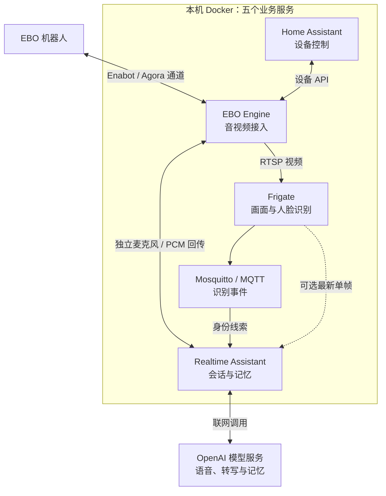
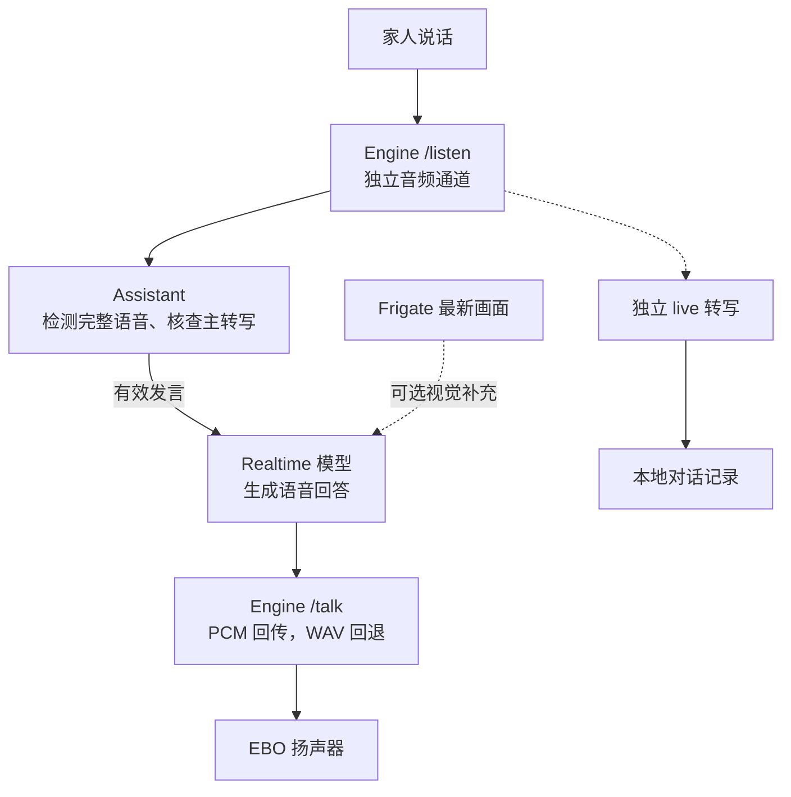
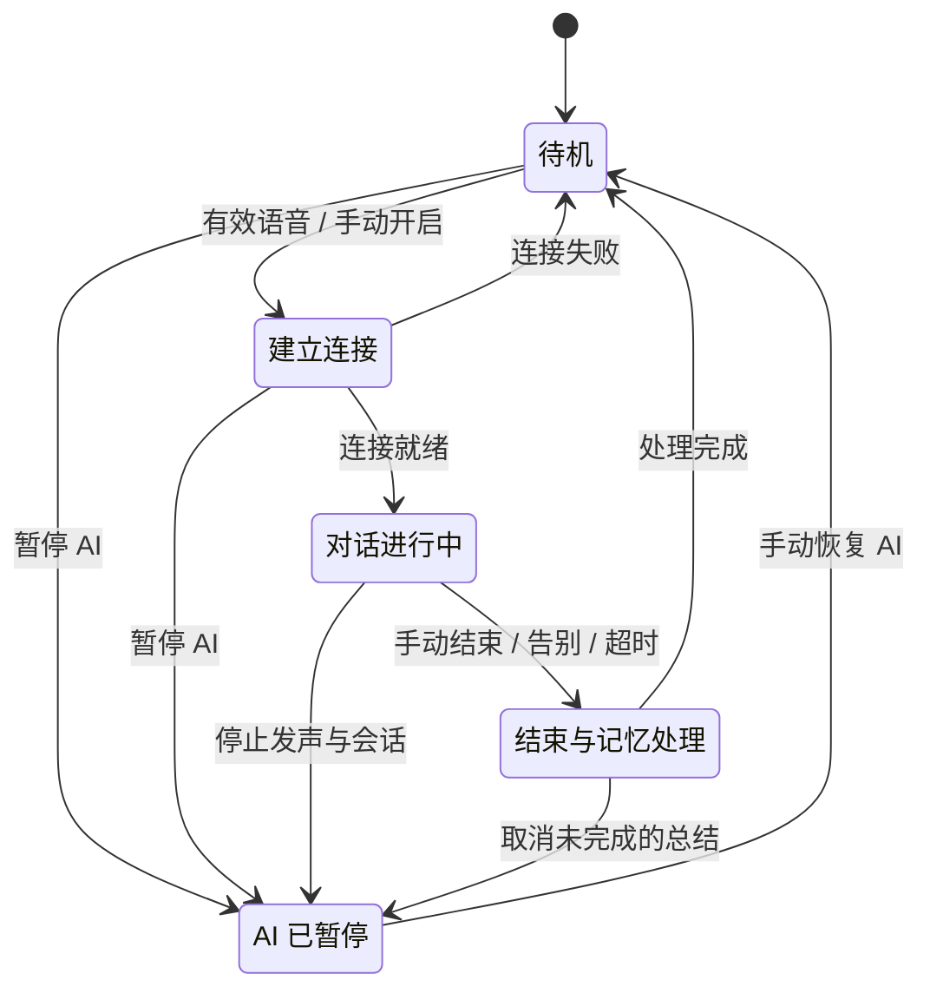
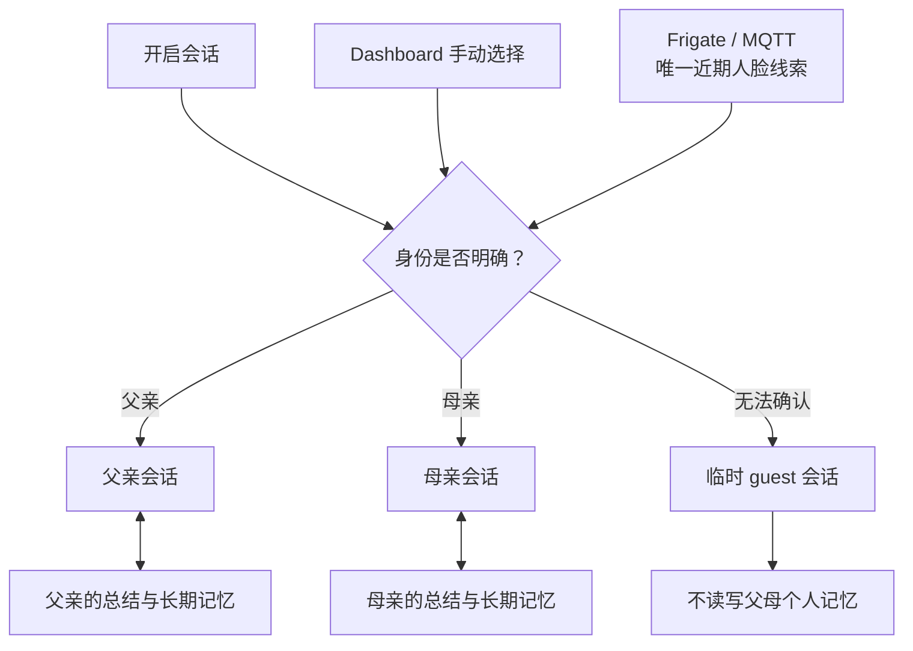
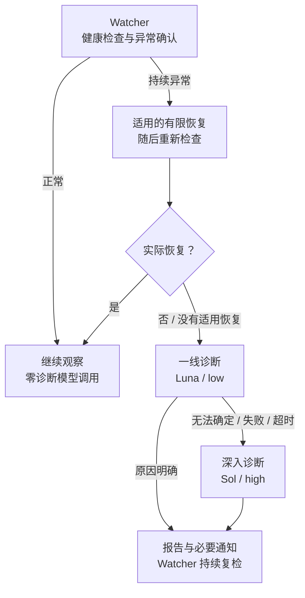
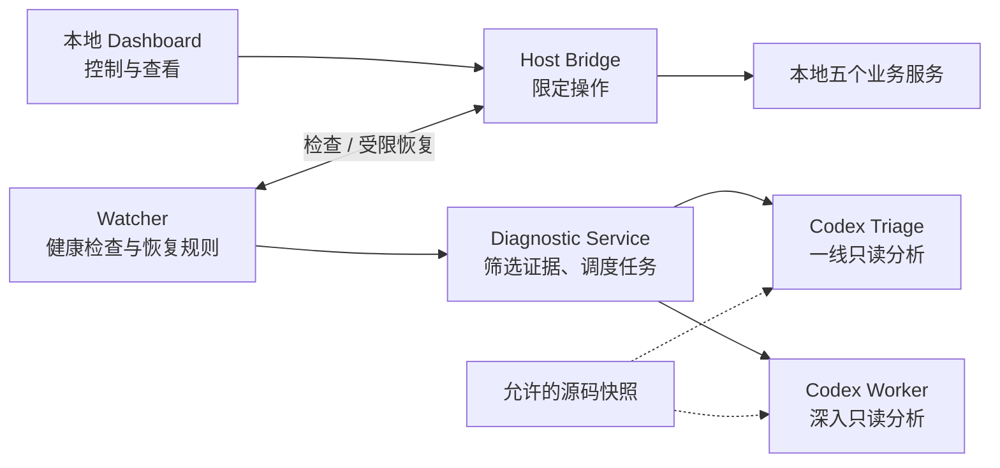
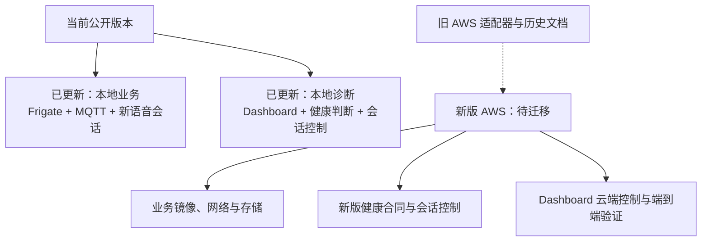

# EBO 家庭助手：新版技术介绍

2026-10-03 · Frigate / `specter-ebo-v2` · [English](TECHNICAL-INTRO.en.md)

这个版本让 EBO 可以与家人语音交流，结合摄像头画面理解现场，并分别保存父母的会话记忆。另有独立的 Diagnostic Agent，负责检查服务、有限恢复和故障说明。

**当前发布的是本地版本。新版 Diagnostic Dashboard 的 AWS 端尚未完成迁移与验证。** 旧版完整保存在 [`archive/pre-frigate-2026-10-03`](https://github.com/YeChen-coder/EBOBotToDigitalPet/tree/archive/pre-frigate-2026-10-03)。

## 1. 系统由什么组成

五个业务服务运行在本机 Docker 中：Engine 连接机器人；Frigate 处理画面和人脸；Mosquitto 传递识别事件；Assistant 管理 AI 对话；Home Assistant 保留设备控制。

**图 1：整体架构。** 本地运行指业务服务在本机；模型仍通过网络调用。它不是完全离线助手。

## 2. 一句话怎样变成回答

待机时，本地检测一段完整语音，再用转写核查它是否有效。会话中，主转写确认有效发言后才请求回复；独立的 live 转写只负责记录。需要公开信息时，助手也可调用网页查询工具。

**图 2：语音主流程与两条辅助分支。** 画面不可用时，健康的音频仍可支持对话。默认轮流说话：AI 播放期间及播完后的短暂保护期不接收新的用户语音；本地插话仍是实验选项。

## 3. 会话有开始，也有结束

同一时刻只开一轮会话。默认通过有效语音或 Dashboard 手动开启，不因看到人脸就自动问候。正常结束后，已知身份的会话会尝试保存总结，再回到待机。

**图 3：用户看到的会话流程。** 待机时没有 Realtime 连接是正常的。暂停 AI 会持续生效，并在重启后保留；它不会停止摄像头、麦克风传输或家人通话。恢复后等待新的唤醒，不重放旧声音。

## 4. 怎样避免用错家人的记忆

Dashboard 可明确选择父亲或母亲。语音唤醒时，只有唯一、近期且可靠的人脸线索才会提示身份；多人、过期或无画面时使用临时访客身份。

**图 4：身份与记忆分开管理。** 正常结束的父母会话可生成总结，后台再整理长期记忆。访客仍可能留下普通对话记录；不保存个人记忆不等于没有日志。人脸识别是身份线索，不是严格的身份认证。

## 5. Diagnostic Agent 怎样处理故障

诊断先检查真实状态，再判断是否需要处置。持续异常时，只执行适用且次数有限的恢复；恢复后重新检查。固定恢复成功时不调用诊断模型，只有仍有问题时才进入模型排查。

**图 5：先检查与恢复，再调用模型。** 模型结论不能代替实际恢复证据。图中的模型简称对应当前示例 `gpt-5.6-luna` 和 `gpt-5.6-sol`，可以配置。初次安装默认观察模式；自动恢复和模型诊断需按操作说明启用。主动暂停、正常待机和停用不会被当作普通崩溃处理。

## 6. 控制服务和诊断模型各管什么

Dashboard 是日常入口，可启动或停止本地项目、暂停 AI、选择会话并查看记录与故障。诊断使用四个独立容器，宿主机 Host Bridge 提供限定的操作入口。

**图 6：诊断与操作权限分离。** 模型读取筛选后的证据和允许的源码快照，没有 Docker/AWS 操作权限，也不自动改代码或部署。原始家庭对话不作为诊断证据交给这些模型。

真实配置、录音、转写、父母记忆、Frigate 人脸数据和诊断状态留在运行机器，并排除 Git。助手业务本身仍会把完成任务所需的语音、图像、转写或记忆内容发送给相应模型。

## 7. 现在能用什么，AWS 还缺什么

当前公开配置为 `runtimeEnvironment=local`、`runtimeControlScope=local`。云端启动请求会被拒绝；本地启停不会查询或启停 AWS。

**图 7：本地新版已发布，AWS 是独立待办。** 保留旧 AWS 代码不等于新版已经在 AWS 可用，也不等于诊断服务已经部署到云端。

日常地址：Dashboard `http://127.0.0.1:8179`；Home Assistant `http://127.0.0.1:8123`；Frigate `https://127.0.0.1:8973`。在 `ebo-ai-home` 目录配置后，用 `scripts/start-ebo-home.ps1` 启动，`scripts/stop-ebo-home.ps1` 停止。

本次公开副本通过了 128 项诊断、102 项助手及 39 项 Engine 相关测试；这些结果不代表新版 AWS 验证完成。

进一步阅读：[本地部署说明](../README.zh-CN.md)、[语音优先设计](assistant-audio-first.zh-CN.md)、[AI 暂停](assistant-pause.zh-CN.md)、[诊断操作说明](../ops/diagnostics/README.zh-CN.md)、[版本与 AWS 待办](RELEASE-2026-10-03.md)。
