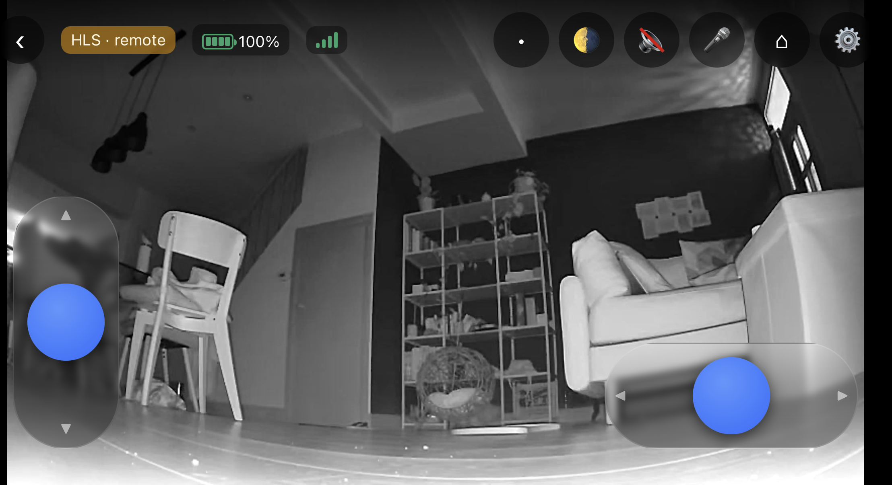
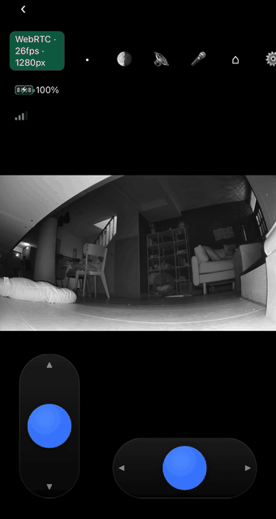
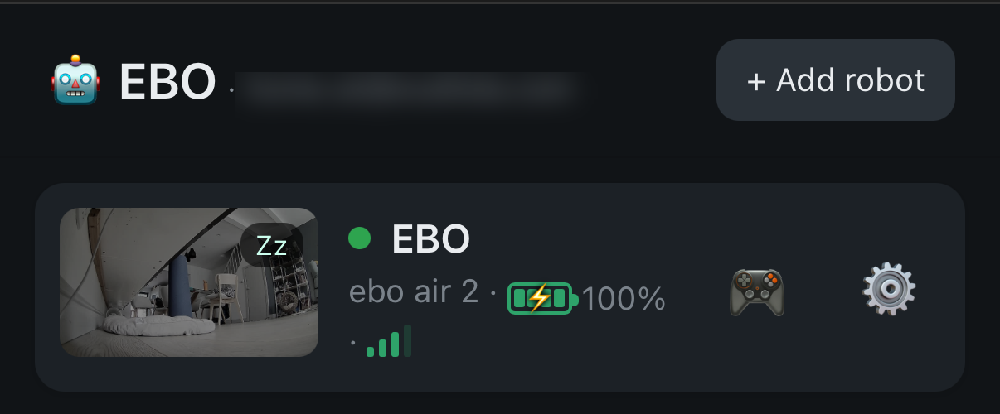
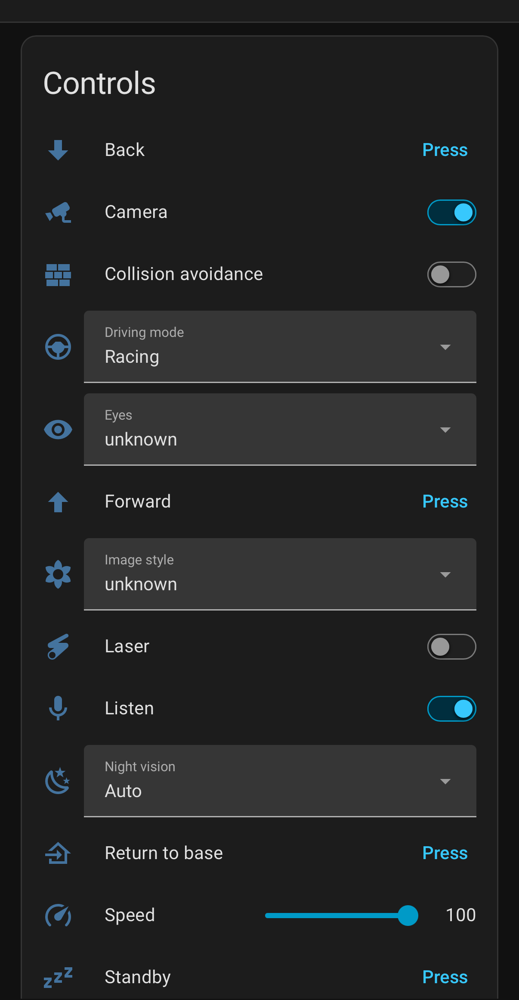

# EBO for Home Assistant (unofficial)

**Drive your Enabot EBO robot from Home Assistant** — see through it, talk through it, and put it
in your automations. No phone app needed.

[](https://github.com/Playcolors-co/ha-enabot/actions/workflows/build.yml)
[](https://github.com/Playcolors-co/ha-enabot/actions/workflows/test.yml)
[](https://github.com/Playcolors-co/ha-enabot/actions/workflows/security.yml)

<p align="center">
  
</p>

<p align="center">
  <em>Full-screen driving: two sticks, ~200 ms video on your LAN, and two-way audio.</em>
</p>

<table>
<tr>
<td width="47%" align="center">
  <br>
  <em>Driving it from a phone — the badge shows the live WebRTC feed at 720p.</em>
</td>
<td width="53%">

| | |
|---|---|
| 🎮 **Drive it** | analog joystick or dual sticks, low-latency WebRTC video |
| 👀 **See it** | a real Home Assistant camera per robot, for dashboards and automations |
| 🔊 **Hear & talk** | listen through the robot's microphone and speak back from your phone |
| 🤖 **Automate it** | every control as an entity — plus an optional MCP server for AI agents |

</td>
</tr>
</table>

<p align="center">
  
  
</p>

<p align="center">
  <em>Left: the sidebar panel (all your robots). Right: one robot as a normal HA device.</em>
</p>

One add-on signs into the Enabot cloud with **your own credentials** (exactly like the EBO HOME
app), discovers **every robot on your account**, and gives you a panel, entities and a live camera
for each.

> ⚠️ Independent, unofficial project. Not affiliated with Enabot or ThroughTek/Agora. It
> interoperates using **your own** credentials and devices, through reverse engineering. Use at
> your own risk; it may break if Enabot changes their API/firmware.

## What you get

- **A sidebar panel** (like Zigbee2MQTT): every robot in one place — live preview, battery, Wi-Fi,
  quick controls (camera, wake/standby, laser, dock), per-robot settings, **pair a new robot**
  (QR, no phone) and **remove a robot** from the account.
- **A distinct device per robot** (battery, Wi-Fi, charging, camera on/off, video quality, speed,
  volume, eyes, dock/laser/wake/standby + a **live camera**) under the **EBO** integration — **no
  MQTT**. The add-on **installs its companion integration itself** (no HACS).
- **A live camera** per robot (RTSP → HA `stream`/go2rtc → WebRTC).

> **No MQTT needed.** The internal bus runs on a broker private to the add-on (localhost). Your
> Home Assistant needs no Mosquitto and no MQTT integration — robots are native EBO devices.

## Supported models

| family | models | how |
|--------|--------|-----|
| **Cloud (this add-on)** | EBO **Air 2** ✅, Air 2 Plus / Air 2S / Mini 🧪, **EBO X / Max** 🧪 | EBO HOME app + Enabot Agora cloud. All robots on your account are discovered automatically; non-Air 2 are experimental. |
| **EBO SE (LAN)** | EBO SE | Different, local-only stack (TUTK/Kalay) — **not** this add-on. Use [ebo-se-lan-bridge](https://github.com/lilium360/ebo-se-lan-bridge) by **lilium360** (Raspberry Pi); it coexists with this add-on. |

## Install

1. **Settings → Add-ons → Add-on Store → ⋮ (top right) → Repositories**
2. Add this URL:
   ```
   https://github.com/Playcolors-co/ha-enabot
   ```
3. Install **EBO for Home Assistant (unofficial)**, enter your Enabot email + password and the two
   app crypto keys (not shipped — see [docs](ebo/DOCS.md)), and start it.
4. The add-on installs its integration into Home Assistant. **Restart Home Assistant once**, then
   **Settings → Devices & Services → + Add Integration → "EBO"** — it finds your robots
   automatically and creates a device + live camera for each. Nothing else to type.

## Why this exists

The Home Assistant community has asked for an Enabot integration
[since 2021](https://community.home-assistant.io/t/enabot-ebo-integration-camera-with-wheels/328355).
The cloud EBO robots are cloud-locked (live video + control go over Agora), so there is no official
integration. This project replicates the app's own cloud flow — encrypted login → Agora RTM
(control/telemetry) + RTC (video, H.265 decoded and re-encoded to H.264/RTSP) — using **your own**
account, and never ships any proprietary Enabot/ThroughTek/Agora key or library.

## Contributing

Another EBO model, bug fixes, a smoother camera — all welcome. See [CONTRIBUTING.md](CONTRIBUTING.md).

## Support

Free, independent work. An optional coffee is appreciated, never required:

☕ **[buymeacoffee.com/scattolacom](https://www.buymeacoffee.com/scattolacom)**

## License

MIT (see [LICENSE](LICENSE)). No proprietary Enabot/ThroughTek/Agora component is included or
redistributed.
