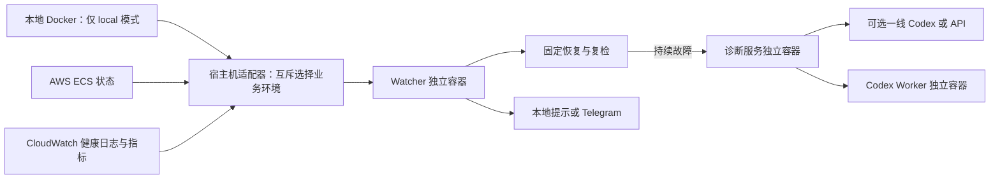

# AWS 接入与运行边界

AWS 是现有监控框架的运行环境适配器。诊断服务和 Codex Worker 不需要知道 AWS 凭据或 CLI，也不导入云端业务代码。第一版支持 ECS/Fargate Service；EC2、EKS 和 Lambda 需要另写适配器，不能仅改名称。



## 配置

1. 把 `aws-target.example.json` 中的目标加入 `config.local.json.targets`，并设置顶层 `runtimeEnvironment: "aws"`。更改账户、区域、集群、服务和容器日志组。每个 ECS Service 配置为一个恢复单元，即使其中有两个业务容器。本地模式填 `local`，不会启动 AWS 后台采样；详细频率/费用及切换方法见 [采样说明](SAMPLING.zh-CN.md)。
2. 把 `aws-host.example.json` 复制为 **宿主机专用**的 `local/aws-host.json`。配置 `readProfile`、CLI 路径；可选 `configFile`、`credentialsFile`、`loginCacheDirectory`。这些文件路径不挂入任何容器。标准 AWS profile 可使用 SSO、IAM 用户、assume-role 或 credential_process；凭据续期由对应 AWS provider 处理，失效后发监控告警。
3. `node scripts/aws-policies.mjs` 生成 `local/iam/<目标>-read.json` 和 `-action.json`，供配置 IAM 身份时审阅。此命令不创建身份或授权。
4. `node scripts/aws-check.mjs` 做一次真实只读检查；加 `--evidence` 检查指标、分类日志和最近停止 Task。输出已筛选，无原始对话日志。退出状态为 0 表示采集入口可用，业务状态仍以 `observation` 为准。
5. 重载宿主机与 Watcher：

```powershell
powershell.exe -NoProfile -File scripts/restart-host-task.ps1
docker compose up -d --build --wait watcher
node --env-file=.env scripts/status.mjs
```

root 登录仅可用 `aws-check.mjs --one-time-root-read` 做人工协作期间的单次验证。后台宿主机明确拒绝 root 身份，不会因这个参数改变长期配置。IAM 身份权限不能靠宿主机命令白名单替代。

本机已在用户授权后完成专用只读 IAM 用户创建与验证，profile 为 `ebo-diagnostics-read`，凭据位于用户目录 `.aws/ebo-diagnostics`。云端目标已经退出维护并启动后台监控；执行身份和自动替换仍关闭。`scripts/provision-aws-reader.mjs --execute` 是人工授权后的安装入口，不属于运行中适配器接口。

| 可调项 | 默认 | 作用 |
|---|---|---|
| enabled / maintenance | 启用 / 非维护 | 停止采集或暂停此目标的处置 |
| aws.connection | aws-cloud | 引用宿主机 profile，可接多个账户 |
| aws.pollSeconds | 60 秒 | ECS 与结构化健康日志采样周期 |
| aws.snapshotMaxAgeSeconds | 180 秒 | 本地缓存失效上限 |
| aws.healthMaxAgeSeconds | 180 秒 | 业务健康事件失效上限，容纳日志传输延迟 |
| aws.selfHealingSeconds | 300 秒 | 等待 ECS 自愈或部署完成的上限 |
| aws.recoverySeconds | 300 秒 | 主动替换后复检等待期 |
| aws.logWindowSeconds / maxLogPages | 600 秒 / 3 页 | 证据窗口与单日志流分页上限 |
| restartOnStall | false | 是否允许固定的 Task 替换流程 |
| actionProfile / allowTaskReplacement | 空 / false | 独立执行身份与宿主机第二道开关 |

同一云端服务不能重复配置成多个目标，从而绕开恢复预算。当前环境中各目标独立持久化故障；某个目标维护或失败不会关闭同环境其他目标的故障。切换业务环境后，旧环境退出采样、诊断和动作授权，其未完成诊断会收到取消，历史与恢复预算保留。

## 健康与恢复规则

- 必须同时满足：期望单 Task、容器与 Task 健康、当前 Task 日志流中的业务健康事件足够新、Engine 有机器人、Assistant 的 Realtime 与真实音视频来源正常。`RUNNING` 本身不证明业务可用。
- 按完整 Task 身份匹配日志流，同时检查事件时间。旧 Task 的健康、过期日志和缓存重复读取不能完成故障确认或持续恢复验证。
- 临时部署/调度异常先等待 ECS 自愈；超过等待期仍不正常才进入原诊断流程。短期至少 3 次 Task 替换视为反复失败，不再主动替换。
- `desiredCount=0` 表示控制面已设定停用，抑制恢复；不会把它改回 1。人工维护也可以明确设置目标 `maintenance=true`。
- AWS 鉴权、连接或遥测时效异常归为“监控失效”：持续后通知，零模型调用，不重启业务。
- ECS liveness 健康但应用媒体卡住时，若启用恢复，可替换整个 Task。先采证，重新检查单实例、无 pending/部署、`minimumHealthyPercent=0`、`maximumPercent=100`；持久化操作预算后，执行前再次核对完整 Task ARN。只 `StopTask` 当前已观察的 Task，由 ECS Service 负责补回。
- **替换会短暂中断同 Task 的 Engine 和 Assistant。**不会单独重启一个 Fargate 容器，不调用 RunTask，不修改 desiredCount、不部署新镜像、不操作机器人开麦/移动。一次失败或结果不确定均保留冷却预算，不能自动重试。
- 恢复成功由后续新的健康采样确认，零模型调用；恢复无效才调用可选一线 Codex/API 并按升级策略进入高级 provider。未配置执行身份时，只使用 ECS 自愈，持续故障诊断与通知。

## 数据与权限

平时只采 ECS 与 `health.snapshot`。确认事故后才采有界日志类别、最近停止原因与 `AWS/ECS` 服务 CPU/内存统计。指标默认只作诊断证据，不因一次高 CPU 就重启。日志只输出固定故障类别与允许的健康字段，原始对话、配置及任意错误全文不进入模型或通知。缺失指标、日志分页截断会明确标记。

读取策略将服务描述限制到指定服务 ARN，Task 状态限制到集群，日志限制到指定日志组。`ListTasks` 以 cluster 条件限制；`GetMetricStatistics` 不支持资源级授权，因此只能限制区域，拥有此身份的人仍可读取该区域的其他指标。宿主机代码只查询配置的服务。执行策略的 StopTask 权限限制到集群 Task ARN；该集群应专用于 EBO，宿主机再校验具体服务与 Task，IAM 本身不能表达这套健康判定。

后台身份不需要 `iam:*`、Secrets Manager、S3、ECS Exec、RunTask 或 UpdateService。读取身份和执行身份可独立撤销。Windows 端登录、联网及 Docker 运行仍是容器诊断的前提；此接入没有把 Watcher 部署到 AWS，也没有覆盖本地电脑断电。

云端业务代码可能比本地只读源码快照更新。证据明确提示模型核对版本，不能把本地源文件推断成云端实际部署代码。新增运行环境时实现 `snapshot / evidence / prepareRestart / restart` 适配接口；新增 AI 仍复用 HTTP job 协议，两类扩展彼此独立。

## 官方依据

- [ECS 调度与部署参数](https://docs.aws.amazon.com/AmazonECS/latest/developerguide/service_definition_parameters.html)：服务负责维持 desiredCount，部署参数决定替换时的容量约束。
- [StopTask](https://docs.aws.amazon.com/cli/latest/reference/ecs/stop-task.html)：停止整个 Task 并向其中容器发送停止信号。
- [ECS 健康语义](https://docs.aws.amazon.com/AmazonECS/latest/APIReference/API_HealthCheck.html)：UNKNOWN 不能作为健康证明。
- [CloudWatch 日志分页](https://docs.aws.amazon.com/AmazonCloudWatchLogs/latest/APIReference/API_FilterLogEvents.html)：空页不一定表示结束，必须检查 nextToken。
- [ECS IAM 权限](https://docs.aws.amazon.com/service-authorization/latest/reference/list_ecs.html)、[Logs 权限](https://docs.aws.amazon.com/service-authorization/latest/reference/list_logs.html)、[指标权限](https://docs.aws.amazon.com/service-authorization/latest/reference/list_cloudwatch.html)。
